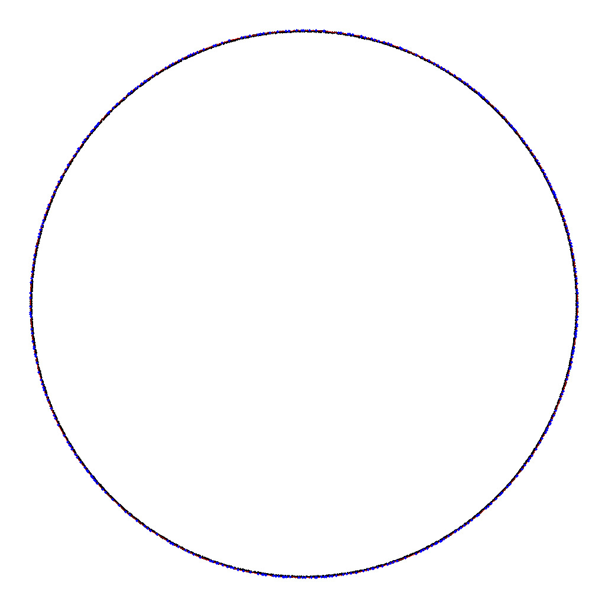

This is a summary of my final project for my CUDA course at the university. You can find the codebase on my [github](https://github.com/JakubZojdzik/gpu-convex-hull).

## Goal

The main goal was to implement a parallel version of the QuickHull algorithm described in the paper [Parallelizing Two Dimensional Convex Hull on NVIDIA GPU and Cell BE](https://cdn.iiit.ac.in/cdn/cvit.iiit.ac.in/images/JournalPublications/2009/Parallelizing_nvidia_gpu.pdf) using CUDA and to compare its performance with sequential algorithm running on CPU.

## Problem

Given a set of points on a plane, the program should find their convex hull, which is the smallest convex set of points, that contains all of the input points. Geometrically it can be interpreted as finding a subset of input points, that forms a polygon containing all the other points.

## Difficulties

The authors of paper describe the algorithm in a general way, without going into detail. There are also a few errors, even in the pseudocode, which makes implementing it harder. They used CUDPP library which is not supported anymore, so I had to find a replacement.

## Result in code 

I managed to implement most of optimizations described in the paper. Some parts - like atomic operations - could be improved, but the paper explanations are too vague for me to properly recreate author's algorithm.
I have also written naive parallel QuickHull algorithm. The main difference is that in naive algorithm, points are not kept sorted by their labels in memory. It simplifies code at the cost of memory locality.
For output (and the performance) comparison, I implemented the monotone chain sequential algorithm.

## Tests

There were two classes of test data:

1. Points were uniformly sampled from unit circle. Tests contain 1, 5, 10, 50 or 100 million points.
2. Points were uniformly sampled from a ring with the inner radius equal to 0.95 and the outer radius equal to 1. Tests contain 0.5, 5or 10 million points.

For every set size there were 10 independent test sets and every test set was run 3 times.

## Results

For points sampled from circle, naive parallel algorithm had only slightly worse performance than the one from paper. CPU did much worse.

For points sampled from ring, naive parallel algorithm did much worse. It is because this algorithm iterates over partitions sequentially, and optimizes only inner-partition calculations. In the case of ring, number of partition is high, and there aren't many points in each of them. On the other hand, algorithm from paper is able to handle multiple partition at once.

## Visualization

In order to validate algorithm's output I implemented visualization for test sets and corresponding results. Here are graphics for convex hull on 50 and 50000 points sampled from circle, and one graphic for points sampled from ring:

